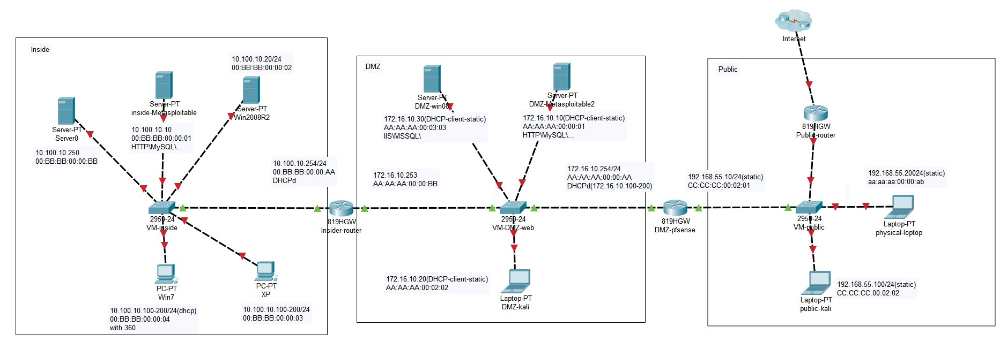
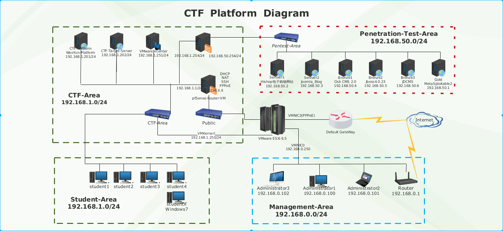

# 渗透测试实验环境（PT-Environment）
本地测试实验环境

## 关于本项目

这个项目是我自己本地的渗透测试实验环境（靶场），现目前只上传了用思科模拟器绘制的网络拓扑图。

## 为什么有这个项目

在日常的APT攻击和防御与渗透测试过程中，我们会遇到一些非常复杂的内部网络环境（包括Windows AD环境），我们需要确保在现实环境中操作之前进行一些战术预言。

因此，我使用VMware Workstation在我的笔记本电脑中构建了整个实验环境。

现目前，该项目只是一个简单的网络拓扑和思科模拟器的文件。 之后，如果有空时我写下具体的配置过程和细节。（其实毕竟只是一些环境的搭建，总体来说并没有什么技术含量，只是自己的学习知识过程的存档。）

## 当前的拓扑

## 关于项目的一些想法

我在大二的时候做了一个“网络靶场”项目的科创项目，当时主要目的是用于网络安全教学和培训。

那时，所有系统都是使用一台VMware Esxi服务器（200G内存的）在一周内构建的。 当时系统拓扑如下如下：

当时这个项目承担了我们信息安全小组的培训、CTF比赛和学期末整个班级的期末实训，在整个过程中也收获了不少经验。

这里附上我项目最后提交的一些文件，现在再看起来真的是太萌新了，有太多的地方可以写的更好：

 - [新型信息安全攻防训练平台-答辩](./files/新型信息安全攻防训练平台-答辩.pptx)
 - [平台使用场景](./files/平台使用场景.docx)
 - [项目结题总结报告](./files/项目结题总结报告.doc)
 - [设计文件与其他文件](./files/设计文件与其他文件.zip)

其实这个项目就是现在各家的CTF靶场平台的雏形，当时甚至还想过以此平台来创业（2015年）。

就个人而言，我觉得“网络靶场”是个人、组织、公司甚至国家的重要网络安全基础设施，是一个实践网络安全知识、应用攻防技术、磨练攻防团队的场所，甚至是测试网络武器的平台，当然现在一些公司、国家也已经建设了相关的平台并开展了演练。
