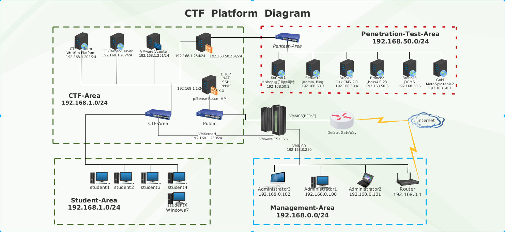

# PT-Environment
Local penetration test experimental environment

[中文版介绍](https://github.com/attacker2001/PT-Environment/blob/master/README-zh.md)

## What's this

This is a Network topology designed by Cisco Packet Tracer in my own laptop.

## Why do this

In the daily APT attack and defense and penetration testing process, we will encounter a very complicated internal network environment(include the Windows AD environment), we need to ensure that there will be no leakage before some actual operations.

So, I used the VMware workstation to build this whole experimental environment in my laptop. 

This is just a simple topology and design file. After that, I will write about the specific configuration process and details when I am free.

This project has no technical content, just an archive of its own learning knowledge process.

## What it looks like now

## In the future

I did a "Cyber Range" project at the university, mainly for cyber security teaching and training. At that time, it was all the systems built with a VMware Esxi server with 200G memory. The system at that time was as follows:

Personally, in fact, the "network shooting range" is an important network security infrastructure for individuals, organizations, companies and even the country. A good shooting range can be a good experimental network environment and exercise offensive and defensive techniques.

Maybe in the future, the above shooting range will be done again and become a real enterprise product.